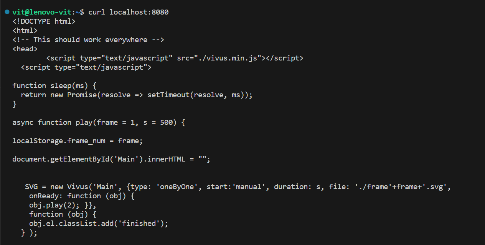
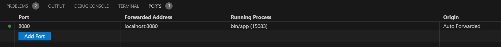

# Курс DevOps практичні завдання

## [Task 2](Task2) - Реалізувати  вебсервіс у власному середовищі розробки 
Планую виконувати практичні завдання на ПК під Windows11, отже фіксую в цьому документі на кроки:
1. Клоную з github вже підготовлений репозиторій в якому планую зберігати всі не великі практичні завдання
`git clone https://github.com/vit-um/DevOps.git`  
2. За доброю порадою колег встановлюю [WSL command](https://learn.microsoft.com/en-us/windows/wsl/install): 
`wsl --install`  
3. В в vscode підключити [відповідний плагін](https://learn.microsoft.com/en-us/windows/wsl/tutorials/wsl-vscode):
4. Встановлюємо компілятор Go:  

```bash
wget https://go.dev/dl/go1.21.3.linux-amd64.tar.gz
sudo -s
rm -rf /usr/local/go && tar -C /usr/local -xzf go1.21.3.linux-amd64.tar.gz
export PATH=$PATH:/usr/local/go/bin
go version
```
`go version go1.21.3 linux/amd6`

5. Встановлюємо всі тулзи, що можуть стати в нагоді: 
`Ctr+Shift+P` -> `Go: Install/Update Tools`
6. Переходимо в теку проекту та ініціюємо його:

```bash
cd Task2
go mod init Task2
go mod tidy
``` 
В разі якщо помилки не зникли можна спробувати зробити [ініціацію робочого простору](https://github.com/golang/tools/blob/master/gopls/doc/workspace.md#go-workspaces-go-118)

7. Добре буде якщо зібрані та службові файли не будуть потрапляти на `github` отже створюємо [.gitignore](.gitignore)

8. Збираємо застосунок: 
`cd Task2 && go build -o bin/app src/main.go`

9. Робимо commit та push-имо:  
```bash
git add *
git add .gitignore 
git commit -m "bin"
git push
```
Заходимо на github щоб пересвідчитись у відсутності там забороненої до синхронізації теки bin та її вмісту.

10. Запускаємо проект `bin/app` та перевіряємо його роботу одним з методів:  

  
  


11. Далі спробуємо запакувати розроблений вище код у контейнер та доставити його споживачу. Для цього нам потрібна буде реєстрація на [docker hub](https://hub.docker.com/) та встановлене розширення `Docker for Visual Studio Code` 

12. Створюємо в теці проекту `Task2` файл [Dockerfile](./Task2/Dockerfile)
