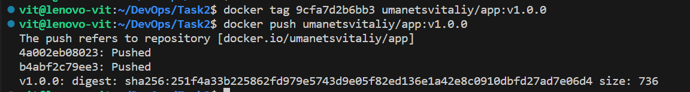
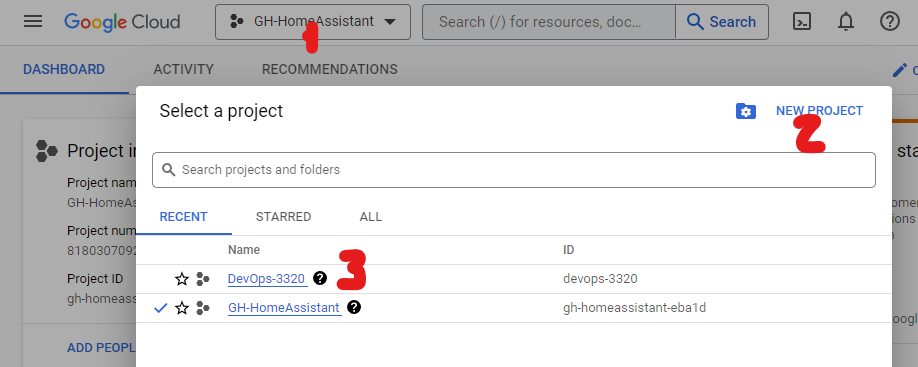
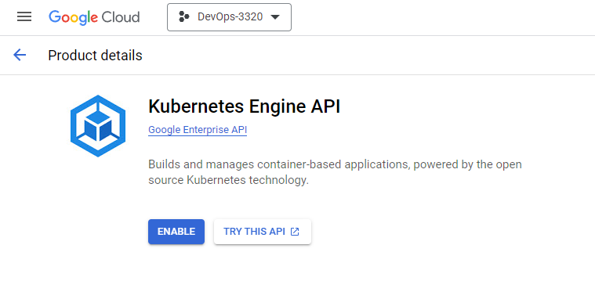
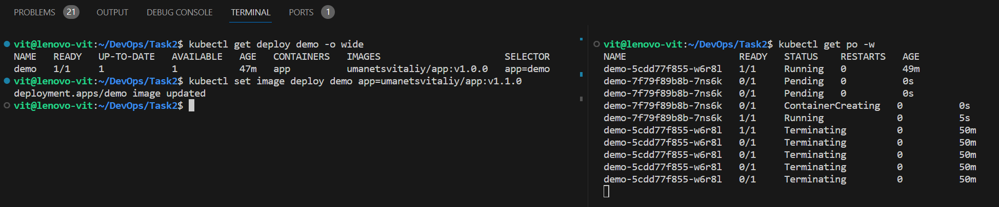

# Курс DevOps практичні завдання

## [Task 2](Task2) - Реалізувати  вебсервіс у власному середовищі розробки 
Планую виконувати практичні завдання на ПК під Windows11, отже фіксую в цьому документі на кроки:
1. Клоную з github вже підготовлений репозиторій в якому планую зберігати всі не великі практичні завдання
`git clone https://github.com/vit-um/DevOps.git`  
2. За доброю порадою колег встановлюю [WSL command](https://learn.microsoft.com/en-us/windows/wsl/install): 
`wsl --install`  
3. В в vscode підключити [відповідний плагін](https://learn.microsoft.com/en-us/windows/wsl/tutorials/wsl-vscode):
4. Встановлюємо компілятор Go:  

```bash
wget https://go.dev/dl/go1.21.3.linux-amd64.tar.gz
sudo -s
rm -rf /usr/local/go && tar -C /usr/local -xzf go1.21.3.linux-amd64.tar.gz
export PATH=$PATH:/usr/local/go/bin
go version
```
`go version go1.21.3 linux/amd6`

5. Встановлюємо всі тулзи, що можуть стати в нагоді: 
`Ctr+Shift+P` -> `Go: Install/Update Tools`
6. Переходимо в теку проекту та ініціюємо його:

```bash
cd Task2
go mod init Task2
go mod tidy
``` 
В разі якщо помилки не зникли можна спробувати зробити [ініціацію робочого простору](https://github.com/golang/tools/blob/master/gopls/doc/workspace.md#go-workspaces-go-118)

7. Добре буде якщо зібрані та службові файли не будуть потрапляти на `github` отже створюємо [.gitignore](.gitignore)

8. Збираємо застосунок: 
```bash
cd Task2 

go build -o bin/app src/main.go`
bin/app

go run src/main.go
```

9. Робимо commit та push-имо:  
```bash
git add *
git add .gitignore 
git commit -m "bin"
git push
```
Заходимо на github щоб пересвідчитись у відсутності там забороненої до синхронізації теки bin та її вмісту.

10. Запускаємо проект `bin/app` та перевіряємо його роботу одним з методів:  

  
  


11. Далі спробуємо запакувати розроблений вище код у контейнер та доставити його споживачу. Для цього нам потрібна буде реєстрація на [docker hub](https://hub.docker.com/) та встановлене розширення `Docker for Visual Studio Code` 

12. Створюємо в теці проекту `Task2` файл [Dockerfile](./Task2/Dockerfile)

13. Згенеруємо файл залежності для нашого проекту:

```bash
cd src
go mod init Task2
cd -
```

14. Командою `docker build` ми запускаємо підготовку снапшоту нашої файлової системи за вказаною інструкцією що містить dockerfile:  

```bash
docker build .
```
Результатом буде записаний образ `writing image sha256:9cfa7d2b6bb336084b1f30bd58d18a0f67545d7ffa65b9df3ce04c8e3240ae7a` який включає наш бінарний сервер, контент та метадані. 

15. Запускаємо процес з контейнеру в ізольованому середовищі. Вказуємо додатково докеру порт на якому слухає наш сервер:  
`docker run -p 8080:8080 sha256:9cfa7d2b6bb336084b1f30bd58d18a0f67545d7ffa65b9df3ce04c8e3240ae7a`  
Перевіряємо роботу сервера за вказівками п.10, бачимо що працює все як раніше, але в ізольованому просторі. 

16. Зробимо наш продукт публічно доступним завантаживши його на докерхаб:
```bash
docker tag 9cfa7d2b6bb3 umanetsvitaliy/app:v1.0.0
docker push umanetsvitaliy/app:v1.0.0
```

  

17. Щоб набути трохи практичного досвіду спробуємо використати [образ автору курсу з репозиторію](https://hub.docker.com/r/denvasyliev/app/tags):  

```bash
# Забираємо образ на локальну машину:
docker pull denvasyliev/app:v1.0.1
# Запускаємо:
docker run -it --name den-container denvasyliev/app:v1.0.1
# Перевіряємо в іншому терміналі статус контейнеру:
docker ps
# Копіюємо контент з іміджу собі на локальний комп'ютер
docker cp 6bf76627fa44:/html ./DevOps/tmp
# Зупиняємо контейнер
docker stop den-container

``` 


18. Створюємо новий проект в [Google Cloud Console](https://console.cloud.google.com/)



19. В правому сайтбарі шукаємо `Kubernetes Engine` та активуємо його кнопкою `Enable`  



20. Встановимо k3d завантаживши його безпосередньо 

`curl -s https://raw.githubusercontent.com/rancher/k3d/main/install.sh | bash`

```
Preparing to install k3d into /usr/local/bin
[sudo] password for admin: 
k3d installed into /usr/local/bin/k3d
Run 'k3d --help' to see what you can do with it.
```
21. Заходимо в робочу директорію проекту та запускаємо команду: `k3d cluster create Task2`  

```
INFO[0000] Prep: Network                                
INFO[0000] Created network 'k3d-Task2'                  
INFO[0000] Created image volume k3d-Task2-images        
INFO[0000] Starting new tools node...                   
INFO[0001] Creating node 'k3d-Task2-server-0'           
INFO[0001] Pulling image 'ghcr.io/k3d-io/k3d-tools:5.6.0' 
INFO[0003] Pulling image 'docker.io/rancher/k3s:v1.27.4-k3s1' 
INFO[0003] Starting Node 'k3d-Task2-tools'              
INFO[0007] Creating LoadBalancer 'k3d-Task2-serverlb'   
INFO[0008] Pulling image 'ghcr.io/k3d-io/k3d-proxy:5.6.0' 
INFO[0013] Using the k3d-tools node to gather environment information 
INFO[0014] Starting new tools node...                   
INFO[0014] Starting Node 'k3d-Task2-tools'              
INFO[0015] Starting cluster 'Task2'                     
INFO[0015] Starting servers...                          
INFO[0015] Starting Node 'k3d-Task2-server-0'           
INFO[0019] All agents already running.                  
INFO[0019] Starting helpers...                          
INFO[0019] Starting Node 'k3d-Task2-serverlb'           
INFO[0026] Injecting records for hostAliases (incl. host.k3d.internal) and for 3 network members into CoreDNS configmap... 
INFO[0028] Cluster 'Task2' created successfully!        
INFO[0028] You can now use it like this:                
kubectl cluster-info
```
22. Переходимо на етап деплойменту для чого створимо кубернетіс деплоймент з посиланням на наш докерхаб:

`kubectl create deploy demo --image umanetsvitaliy/app:v1.0.0`
```
deployment.apps/demo created
```

23. Зробимо локальний порт-форвардінг в контейнер та перевіримо як це працює 

`kubectl port-forward deploy/demo 8080`
```
Forwarding from 127.0.0.1:8080 -> 8080
Forwarding from [::1]:8080 -> 8080
Handling connection for 8080
Handling connection for 8080
```
Отже сервер знову працює в ізольованому просторі за адресою `http://localhost:8080/` але вже на іншому рівні, тепер нам доступні інструменти управління, моніторингу та контролю Кубернетіс. 

24. Замикаємо процес розробки додаванням нових можливостей в програмний код нашого проектую. Для чого додамо в контент директорію svg файлів та змінимо код web-сторінки, щоб вона транслювала анімований сюжетний ряд. Після чого зберемо код та піднімемо версію проекту:

`docker build . -t umanetsvitaliy/app:v1.1.0`  
`docker push umanetsvitaliy/app:v1.1.0`  

```
The push refers to repository [docker.io/umanetsvitaliy/app]
4a002eb08023: Layer already exists 
b44788e15260: Pushed 
v1.1.0: digest: sha256:283124ac1ae4c43cfe7893af85feed2ebda570943440b3c9161a8d76388ec80f size: 738
```
25. Реалізуємо оновлення версії проекту на нову без переривання сервісу, для чого запускаємо в двох окремих терміналах наступні команди:
- Термінал 1 (команда оновлення версії):  
`kubectl get deploy demo -o wide`
`kubectl set image deploy demo app=umanetsvitaliy/app:v1.1.0`


- На другому терміналі вивід поточного стану на кластері
`kubectl get po -w`

  
