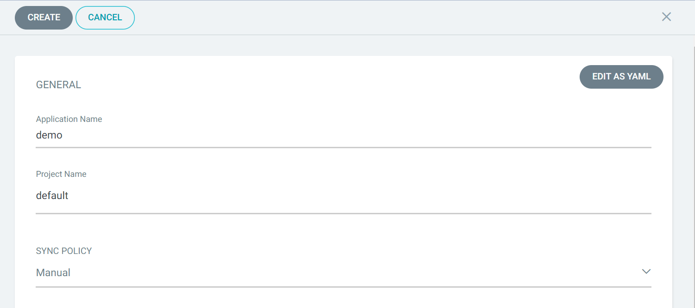
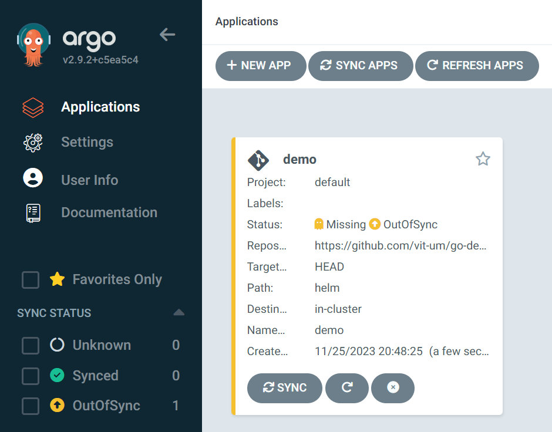
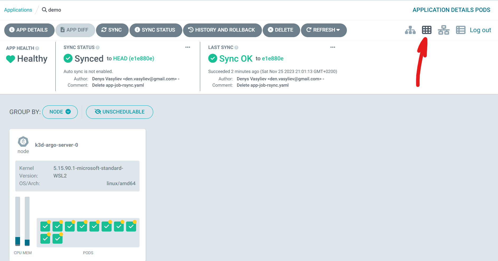
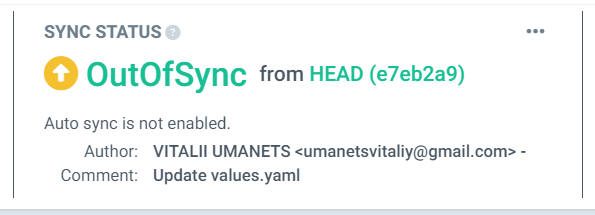

## Proof of Concept. ArgoCD

`Ціль:`Довести технічну чи концептуальну життєздатність ідеї та концепції застосування ArgoCD в якості інструменту CD. Докажимо, що є технічно можливим реалізувати ідею.

`Зміст документації:` На цьому етапі документація може містити опис концепції, аналіз технічних можливостей, визначення обраного стеку технологій, короткий план виконання, технічні сценарії та метрики успіху PoC.

В цьому розділі буде розглянуто набір інструментів для розгортання застосунків будь якої складності. Почнемо з підготовленого [репозиторію](https://github.com/vit-um) та напишемо трохи коду для автоматизації всього процесу `CI` від білда до артефакту. Після цього у нас виникають ще варіанти інструментів для етапу `CD`  

Delivery ми організуємо за моделлю `pull` або втягування змін з репозиторію. Виберемо підхід "one application - one cluster", тоб-то для кожного додатку буде взятий один окремий кластер. З цією метою використаємо "single host kubernetes cluster" А в якості системи Delivery та Deploy на тестове оточення виберемо [ArgoCD](https://argo-cd.readthedocs.io/en/stable/).  

  

`ArgoCD` реалізує підхід GitOps використовуючи репозиторій Git як джерело істини для визначення бажаного стану програми. Маніфести Kubernetes можна вказувати кількома способами:  
- [kustomize](https://kustomize.io/) applications  
- [helm](https://helm.sh/) charts
- [jsonnet](https://jsonnet.org/) files
- Plain directory of YAML/json manifests  

`ArgoCD`- це контролер Kubernetes який безперервно відстежує запущені додатки та порівнює поточний стан з бажаним. Деплоймент поточній стан якого відрізняється від цільового вважається `out of sync` ArgoCD інформує та візуалізує відмінності надаючи можливості для автоматичної або ручної синхронізації бажаного стану. 

1. Підготуємо в окремий локальний кластер для встановлення ArgoCD. Налаштуємо його:  
```bash
$ k3d cluster create argo
... 
INFO[0029] Cluster 'argo' created successfully!         
INFO[0029] You can now use it like this: kubectl cluster-info

$ kubectl cluster-info
Kubernetes control plane is running at https://0.0.0.0:43297
CoreDNS is running at https://0.0.0.0:43297/api/v1/namespaces/kube-system/services/kube-dns:dns/proxy
Metrics-server is running at https://0.0.0.0:43297/api/v1/namespaces/kube-system/services/https:metrics-server:https/proxy

$ k version
$ k get all -A
```
2. Інсталяція 
ArgoCD можна встановити за допомогою `Helm`, але зараз використаємо скрипт з офіційного репозиторію [ArgoCD](https://argo-cd.readthedocs.io/en/stable/#quick-start) Спочатку створимо неймспейс в якому буде встановлено систему, потім скористаємось скриптом (маніфестом) для інсталяції та перевіримо стан системи після встановлення:     
```bash
$ kubectl create namespace argocd
namespace/argocd created

$ k get ns
NAME              STATUS   AGE
kube-system       Active   80m
default           Active   80m
kube-public       Active   80m
kube-node-lease   Active   80m
argocd            Active   28s

$ kubectl apply -n argocd -f https://raw.githubusercontent.com/argoproj/argo-cd/stable/manifests/install.yaml

$ k get all -n argocd

# перевіримо статус контейнерів: 
$ k get pod -n argocd -w
NAME                                                READY   STATUS    RESTARTS   AGE
argocd-redis-b5d6bf5f5-sqlgw                        1/1     Running   0          3m41s
argocd-notifications-controller-589b479947-fm4kp    1/1     Running   0          3m41s
argocd-applicationset-controller-6f9d6cfd58-9rvjf   1/1     Running   0          3m41s
argocd-dex-server-6df5d4f8c4-nd829                  1/1     Running   0          3m41s
argocd-application-controller-0                     1/1     Running   0          3m40s
argocd-server-7459448d56-xnrvf                      1/1     Running   0          3m40s
argocd-repo-server-7b75b45897-qsw9z                 1/1     Running   0          3m41s
```
3. Отримаємо доступ до інтерфейсу ArgoCD GUI 
[Отримати доступ](https://argo-cd.readthedocs.io/en/stable/getting_started/#3-access-the-argo-cd-api-server) можна в два шляхи:  
- Service Type Load Balancer  
- Ingress  
- Port Forwarding 

Скористаємось `Port Forwarding` за допомогою локального порта 8080. В команді ми посилаємось на сервіс `svc/argocd-server` який знаходиться в namespace `-n argocd`. Kubectl автоматично знайде endpoint сервісу та встановить переадресацію портів з локального порту 8080 на віддалений 443 
```bash
$ kubectl port-forward svc/argocd-server -n argocd 8080:443&
[1] 23820
Forwarding from 127.0.0.1:8080 -> 8080
Forwarding from [::1]:8080 -> 8080
Handling connection for 8080
```
ArgoCD за замовчуванням працює з https тому при спробі відкрити [127.0.0.1:8080](https://127.0.0.1:8080/) ми отримаємо помилку сертифікати. Отже в продуктивній системі потрібно встановлювати сертифікати та налаштовувати ці моменти. 

4. Отримання паролю 
Використаємо команду для отримання паролю, вкажемо файл сікрету `argocd-initial-admin-secret` а також формат  виводу `jsonpath="{.data.password}"`. Це поверне нам base64 закодований пароль, після чого використаємо команду `base64 -d` для повернення паролю в простий текст. Отриманий пароль та логін `admin` вводимо в Web-інтерфейс ArgoCD   
```bash
$ k -n argocd get secret argocd-initial-admin-secret -o jsonpath="{.data.password}"
cFZIWTM3eFpJR3hDeUxLNQ==#                                                                                                        
$ k -n argocd get secret argocd-initial-admin-secret -o jsonpath="{.data.password}"|base64 -d;echo
pVHY37xZIGxCyLK5
```
5. Створимо додаток за допомогою графічного інтерфейсу. 
Тепер налаштовані в ArgoCD додатки будуть автоматично встановлюватись на оновлятись в Kubernetes. 
- Натискаємо `+ NEW APP` 
- Вводимо ім'я додатку `demo`
- Проект до якого належить додаток оберемо `за замовчуванням`
- Тип синхронізації залишаємо `Manual`
  
- У розділі `SOURCE` тип джерела залишаємо за замовчуванням `GIT`
- Введемо `url` репозиторію, який містить маніфести для розгортання https://github.com/vit-um/go-demo-app (це буде helm charts, або пакет маніфестів який являє собою групу об'єктів для Kubernetes та нашого додатку)
- У полі `Path` введемо шлях до каталогу `helm`  
  
- В розділі `DESTINATION` вкажемо `url` локального кластеру та `Namespace` demo після чого ArgoCD автоматично визначить параметри додатку використавши маніфести, які знаходяться в репозиторії. В разі бажання змінити значення вручну можна змінити іх значення в розділі `PARAMETERS`.  
  
- У розділі політика синхронізація вкажемо як додаток буде синхронізуватись з репозиторієм. Тут важливо вказати ArgoCD щоб створив новий namespace так як в helm цю функцію за замовчуванням прибрали. Ставимо галку напроти `AUTO-CREATE NAMESPACE`   
- Створюємо додаток кнопкою `CREATE`  
  

6. Переглянемо деталі розгорнутого застосунку натиснувши на нього в списку.  
Графічний інтерфейс надає ієрархічне уявлення про компоненти програми, їх розгортання та поточний стан у кластері. 

  

7. Синхронізація застосунку 
- Для цього у вікні відомостей про програму натискаємо кнопку `SYNC` 
- Праворуч вискакує вікно в якому потрібно обрати компоненти та режими синхронізації та натиснути кнопку `SYNCHRONIZE`  
- Після завершення процесу можемо перевірити правильність розгортання програми, перевіривши її статус у кластері:  

  

8. Прослідкуємо за реакцією ArgoCD на зміни в репозиторію.
- Змінимо в файлі репозиторію https://github.com/vit-um/go-demo-app/blob/master/helm/values.yaml тип шлюзу з `NodePort` на `LoadBalancer` (останній рядок файлу)  



```bath
$ k get svc -n demo
NAME               TYPE        CLUSTER-IP      EXTERNAL-IP   PORT(S)                                                 AGE
demo-nats          ClusterIP   None            <none>        4222/TCP,6222/TCP,8222/TCP,7777/TCP,7422/TCP,7522/TCP   31m
demo-front         ClusterIP   10.43.247.92    <none>        80/TCP                                                  31m
cache              ClusterIP   10.43.234.48    <none>        6379/TCP                                                31m
ambassador         NodePort    10.43.190.212   <none>        80:30092/TCP                                            31m
```
- Викликаний процес синхронізації отримає останню версію репозиторію гіт та порівняє її з поточним станом. Таким чином бачимо що тип сервісу для ambassador змінився з NodePort на LoadBalancer та відповідно був оновлений маніфест Kubernetes
```bath
$ NAME               TYPE           CLUSTER-IP      EXTERNAL-IP   PORT(S)             AGE
ambassador         LoadBalancer   10.43.190.212   <pending>     80:30092/TCP          35m
```
