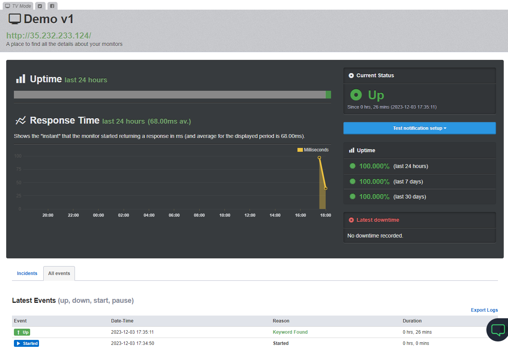

# Налаштувати моніторинговий сервіс Uptime Robot для застосунку в Kubernetes кластер на Google Cloud

## Задача 1

1. Розгорніть Kubernetes кластер на Google Cloud за допомогою gcloud cli
```sh
$ gcloud beta interactive 

$ gcloud container clusters create demo --zone us-central1-a --machine-type e2-medium --num-nodes 2

$ gcloud container clusters get-credentials demo --zone us-central1-a --project devops-55250
Fetching cluster endpoint and auth data.
kubeconfig entry generated for demo.

$ gcloud config set project devops-55250
Updated property [core/project].

$ gcloud container clusters list
NAME: demo
LOCATION: us-central1-a
MASTER_VERSION: 1.27.3-gke.100
MASTER_IP: 35.184.245.57
MACHINE_TYPE: e2-medium
NODE_VERSION: 1.27.3-gke.100
NUM_NODES: 2
STATUS: RUNNING
```

2. Після отримання доступу до кластеру, створіть deployment v1.0.0 що повертає версію “Version: 1.0.0”

```Dockerfile
    FROM busybox 
    CMD while true; do { echo -e 'HTTP/1.1 200 OK\n\n Version: 1.0.0'; } | nc -vlp 8080; done
    EXPOSE 8080
```
```sh
$ docker build .
[+] Building 1.3s (5/5) FINISHED      

$ docker images
REPOSITORY   TAG       IMAGE ID       CREATED        SIZE
<none>       <none>    c613587b7e6b   4 months ago   4.26MB

$ docker tag c613587b7e6b gcr.io/devops-55250/demo:v1.0.0

$ docker images                                          
REPOSITORY                 TAG       IMAGE ID       CREATED        SIZE
gcr.io/devops-55250/demo   v1.0.0    c613587b7e6b   4 months ago   4.26MB

$ k create deployment demo --image gcr.io/devops-55250/demo:v1.0.0
deployment.apps/demo created

$ k get deploy
NAME   READY   UP-TO-DATE   AVAILABLE   AGE
demo   1/1     1            1           34s

```

3. Налаштуйте сервіс типу LoadBalancer та отримайте IP-адресу

```sh
$ k config set-context --current --namespace demo
Context "gke_devops-55250_us-central1-a_demo" modified.
$ k config current-context                       
gke_devops-55250_us-central1-a_demo

$ k expose deployment demo --port 80 --type LoadBalancer --target-port 8080 
service/demo exposed

$ k get svc      
NAME   TYPE           CLUSTER-IP   EXTERNAL-IP      PORT(S)        AGE
demo   LoadBalancer   10.68.3.55   35.232.233.124   80:30356/TCP   56s

$ ping 35.232.233.124
PING 35.232.233.124 (35.232.233.124) 56(84) bytes of data.
64 bytes from 35.232.233.124: icmp_seq=1 ttl=105 time=102 ms

$ LB=$(k get svc demo -o jsonpath="{..ingress[0].ip}")

$ curl $LB
 Version: 1.0.0
```

4. Налаштуйте Monitor Type Keyword у Uptime Robot вказавши IP-адресу балансера та Keyword “Version: 1.0.0”


5. Моніторингова система перевірить в реальному часі доступність першої версії



6. Налаштуйте публічну status page додавши до неї перший Monitoring

[](https://stats.uptimerobot.com/ZB6xysPxk1)   


## Задача 2

7. Наступним кроком внесіть зміни у програму, збілдайте та запуште нову версію контейнеру у контейнер реєстр

```sh
$ nano Dockerfile 
$ docker build .

$ docker images
REPOSITORY                 TAG       IMAGE ID       CREATED        SIZE
gcr.io/devops-55250/demo   v1.0.0    c613587b7e6b   4 months ago   4.26MB
<none>                     <none>    a996fa979dcd   4 months ago   4.26MB

$ docker tag a996fa979dcd gcr.io/devops-55250/demo:v2.0.0
$ docker images                                          
REPOSITORY                 TAG       IMAGE ID       CREATED        SIZE
gcr.io/devops-55250/demo   v1.0.0    c613587b7e6b   4 months ago   4.26MB
gcr.io/devops-55250/demo   v2.0.0    a996fa979dcd   4 months ago   4.26MB

$ docker push gcr.io/devops-55250/demo:v2.0.0
```
8. Створить новий деплоймент з версію образу v2.0.0
```sh
$ k annotate deploy demo kubernetes.io/change-cause="create v1.0.0"

$ k create deployment demo2 --image gcr.io/devops-55250/demo:v2.0.0
deployment.apps/demo2 created

$ k get deploy
k get deploy
NAME    READY   UP-TO-DATE   AVAILABLE   AGE
demo    1/1     1            1           77m
demo2   1/1     1            1           12s

$ k annotate deploy demo2 kubernetes.io/change-cause="update to v2.0.0"

$ k rollout history deployment                                  
deployment.apps/demo 
REVISION  CHANGE-CAUSE
1         create v1.0.0

deployment.apps/demo2 
REVISION  CHANGE-CAUSE
1         update to v2.0.0

```

9. Переведіть трафік з першої на другу версію методами: Canary (25%) та Blue-Green (100%) Deployment

```sh
# Blue-Green (100%) Metod 1
$ k set image deploy demo demo=gcr.io/devops-55250/demo:v2.0.0
$ k set image deploy demo demo=gcr.io/devops-55250/demo:v1.0.0

$ k get pod --show-labels   
NAME                     READY   STATUS    RESTARTS   AGE   LABELS
demo-6695d747b4-99c76    1/1     Running   0          12m   app=demo,pod-template-hash=6695d747b4
demo2-864f955495-dgmvk   1/1     Running   0          12m   app=demo2,pod-template-hash=864f955495

# Blue-Green (100%) Metod 2
$ k get svc -o wide
NAME   TYPE           CLUSTER-IP   EXTERNAL-IP      PORT(S)        AGE    SELECTOR
demo   LoadBalancer   10.68.3.55   35.232.233.124   80:30356/TCP   144m   app=demo

$ k edit svc demo

$ k get svc -o wide       
NAME   TYPE           CLUSTER-IP   EXTERNAL-IP      PORT(S)        AGE    SELECTOR
demo   LoadBalancer   10.68.3.55   35.232.233.124   80:30356/TCP   3h1m   app=demo2

#  Canary (25%) v2.0.0 - 5 pods, v2.0.0 - 15 pods
$ k scale deployment demo2 --replicas 5
$ k scale deployment demo --replicas 15

$ k get pod                             
NAME                     READY   STATUS    RESTARTS   AGE
demo-6695d747b4-99c76    1/1     Running   0          68m
demo-6695d747b4-hbzs7    1/1     Running   0          52s
demo-6695d747b4-hf5b5    1/1     Running   0          52s
demo-6695d747b4-nw6h2    1/1     Running   0          52s
demo-6695d747b4-rbr8z    1/1     Running   0          37s
demo-864f955495-24m8j    1/1     Running   0          5s
demo-864f955495-26ljk    1/1     Running   0          5s
demo-864f955495-5n6wk    1/1     Running   0          6s
demo-864f955495-5rwnn    1/1     Running   0          6s
demo-864f955495-6rfwp    1/1     Running   0          5s
demo-864f955495-c96dx    1/1     Running   0          6s
demo-864f955495-dgmvk    1/1     Running   0          67m
demo-864f955495-dzcnf    1/1     Running   0          5s
demo-864f955495-krqct    1/1     Running   0          5s
demo-864f955495-l6nfw    1/1     Running   0          5s
demo2-864f955495-m77ng   1/1     Running   0          6s
demo2-864f955495-r4czk   1/1     Running   0          5s
demo2-864f955495-tjl5v   1/1     Running   0          6s
demo2-864f955495-vmhxg   1/1     Running   0          5s
demo2-864f955495-xcx6h   1/1     Running   0          5s

$ k label po --all run=demo

$ k get pod --show-labels  
NAME                     READY   STATUS    RESTARTS   AGE     LABELS
demo-6695d747b4-99c76    1/1     Running   0          76m     app=demo,pod-template-hash=6695d747b4,run=demo
# - - -
demo2-864f955495-xcx6h   1/1     Running   0          7m54s   app=demo2,pod-template-hash=864f955495,run=demo

$ k edit svc demo
```

10. По завершенню тестування, залишіть активною v2.0.0 на 100%
```sh
$ k scale deployment demo --replicas 0
deployment.apps/demo scaled

$ k scale deployment demo2 --replicas 1
deployment.apps/demo2 scaled

$ k get pod --show-labels  
NAME                     READY   STATUS    RESTARTS   AGE   LABELS
demo2-864f955495-dgmvk   1/1     Running   0          82m   app=demo2,pod-template-hash=864f955495,run=demo
```

11. Налаштуйте Monitor Type Keyword у Uptime Robot вказавши IP-адресу балансера та Keyword “Version: 2.0.0”

Повторити дії за п.4

12. Моніторингова система перевірить в реальному часі доступність другої версії

Повторити дії за п.5

13. Налаштуйте публічну status page додавши до неї другий Monitoring

https://stats.uptimerobot.com/ZB6xysPxk1

  

## Зачистка:

```sh
$ gcloud container clusters delete demo --zone us-central1-a                          

The following clusters will be deleted.
 - [demo] in [us-central1-a]

Do you want to continue (Y/n)?  Y

Deleting cluster demo...done.                                                                                                                                                                                                                                                                     Deleted [https://container.googleapis.com/v1/projects/devops-55250/zones/us-central1-a/clusters/demo].

$ docker images
REPOSITORY                 TAG       IMAGE ID       CREATED        SIZE
gcr.io/devops-55250/demo   v1.0.0    c613587b7e6b   4 months ago   4.26MB
gcr.io/devops-55250/demo   v2.0.0    a996fa979dcd   4 months ago   4.26MB

$ docker rmi c613587b7e6b
Untagged: gcr.io/devops-55250/demo:v1.0.0
Untagged: gcr.io/devops-55250/demo@sha256:5d7d48c7e01ae5e628eb5286622b0ce5b1cc412ab5767e848c3886473d44ef44
Deleted: sha256:c613587b7e6b6f6ec82910313483164bfef8e07af13c5a6493aa4cbf80889be1

$ docker rmi a996fa979dcd
Untagged: gcr.io/devops-55250/demo:v2.0.0
Untagged: gcr.io/devops-55250/demo@sha256:ff121a92885d0db7e612710d3e7fc06f3927b4327b9484ea6a107197ad976a04
Deleted: sha256:a996fa979dcd85195b7c21e7f2da6ed85f4af3a90fe728365abb3832d8bc9c14
```
