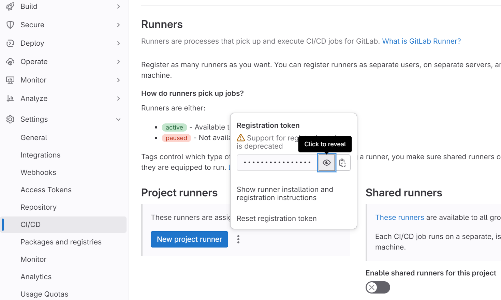

# Task14 Міграція Pipeline в gitlab cicd
1. Реєструємось та експортуємо наш проект з GitHUB на [GitLAB](https://gitlab.com/vit-um/kbot)
2. Клонуємо репозиторій на локальну машину `git clone https://gitlab.com/vit-um/kbot.git`
3. На віддаленому репозиторії натискаємо Edit -> Web IDE
2. Створюємо файл `.gitlab-ci.yml` та починаємо описувати в ньому процес CI

https://docs.gitlab.com/runner/install/docker.html

docker run -d --name gitlab-runner --restart always \
  -v /srv/gitlab-runner/config:/etc/gitlab-runner \
  -v /var/run/docker.sock:/var/run/docker.sock \
  gitlab/gitlab-runner:latest
9c7792bd0f6f5e38043d394c3262c793b53fda966e67a30268755bce2523f893

 $ docker container ls
CONTAINER ID   IMAGE                         COMMAND                  CREATED         STATUS         PORTS     NAMES
9c7792bd0f6f   gitlab/gitlab-runner:latest   "/usr/bin/dumb-init …"   5 seconds ago   Up 4 seconds             gitlab-runner

docker images
REPOSITORY             TAG       IMAGE ID       CREATED       SIZE
gitlab/gitlab-runner   latest    982f26ce4e50   3 weeks ago   760MB

https://docs.gitlab.com/runner/register/index.html

curl -L https://packages.gitlab.com/install/repositories/runner/gitlab-runner/script.deb.sh | sudo bash

sudo apt-get install gitlab-runner

sudo gitlab-runner register --url https://gitlab.com/ --registration-token GR1348941yyZrwfRxzSCdh65NSi2S

shell
Runner registered successfully. Feel free to start it, but if it's running already the config should be automatically reloaded!
 
Configuration (with the authentication token) was saved in "/etc/gitlab-runner/config.toml" 

https://vitum-kbot-a5sm07jdp88.ws-eu107.gitpod.io/

9.  instance : Цей варіант дозволяє запускати задачі без використання окремого виконавця. Ви можете використовувати цей варіант, якщо ви хочете виконувати задачі безпосередньо на машині GitLab Runner. 
 
10.  custom : Цей варіант дозволяє вам налаштувати власний виконавець для виконання задач. Ви можете використовувати цей варіант, якщо у вас є специфічні потреби або власна інфраструктура. 
 
11.  docker : Цей варіант використовує Docker для запуску контейнерів і виконання задач. Це може бути зручним варіантом для багатьох випадків використання, оскільки Docker надає ізольоване середовище та легко керується. 

3. Доопрацювати:
- Запустити пейплайн  
https://www.youtube.com/watch?v=jAIhhULc7YA  
https://www.youtube.com/watch?v=phlsVGysQSw  
https://habr.com/ru/articles/764568/
https://habr.com/ru/companies/rostelecom/articles/546702/#gitlab_runner_install
https://www.youtube.com/watch?v=phlsVGysQSw

