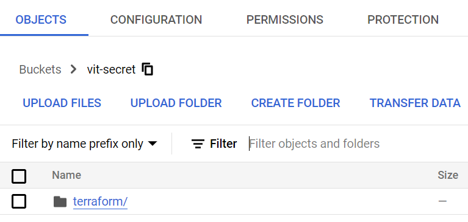

# Підготовка інфраструктурного репозиторію для створення GKE кластеру.

## Створення початкового коду IAC.
1. Роботу будемо виконувати на локальному комп'ютері, отже виконаємо [Authorize the gcloud CLI](https://cloud.google.com/sdk/docs/authorizing)
```sh
$ gcloud init
* Commands that require authentication will use umanetsvitaliy@gmail.com by default
* Commands will reference project `vit-um` by default
* Compute Engine commands will use region `europe-west3` by default
* Compute Engine commands will use zone `europe-west3-c` by default

$ gcloud auth list
     Credentialed Accounts
ACTIVE  ACCOUNT
*       umanetsvitaliy@gmail.com
$ gcloud info
Google Cloud SDK [456.0.0]
```
2. У файлі main.tf додайте наступний блок коду:
```hlc
module "gke_cluster" {
  source         = "github.com/vit-um/tf-google-gke-cluster"
  GOOGLE_REGION  = var.GOOGLE_REGION
  GOOGLE_PROJECT = var.GOOGLE_PROJECT
  GKE_NUM_NODES  = 2
}
```

3. Файл `vars.tfvars` використовується для зберігання чутливої конфігурації Terraform у вигляді змінних. Цей файл додамо в виключення `.gitignore`   

Ці змінні можуть використовуватися в інших файлах Terraform, таких як main.tf і variables.tf.
Ось приклад файлу vars.tfvars, який містить змінну name:
```hcl
GOOGLE_PROJECT = "vit-um"
```
З файлу variables.tf виключимо значення цієї змінної за замовчуванням:
```hlc
variable "GOOGLE_PROJECT" {
  type        = string
  default     = ""
  description = "GCP project to use"
}
```
4. У cloud shell терміналі перейдіть до директорії, де знаходяться ваші файли Terraform, і запустіть terraform init, щоб ініціалізувати проєкт.
```sh
✗ tf init                              
Terraform has been successfully initialized!

✗ tf fmt
✗ tf validate
Success! The configuration is valid.
✗ gcloud auth login
✗ gcloud auth application-default login
✗ tf plan -var-file=vars.tfvars
Plan: 3 to add, 0 to change, 0 to destroy.
```

## Тестування та оцінка затрат на інфраструктуру.
1. У терміналі перейдіть до каталогу, де знаходяться файли Terraform, і запустіть infracost, щоб проаналізувати конфігурацію Terraform і оцінити вартість змін у вашій інфраструктурі.
```sh
✗ infracost breakdown --path .

2023-12-17T17:56:54+02:00 INF Enabled policies V2
2023-12-17T17:56:54+02:00 INF Enabled tag policies
Evaluating Terraform directory at .
  ✔ Downloading Terraform modules
  ✔ Evaluating Terraform directory 
  ✔ Retrieving cloud prices to calculate costs 

Project: vit-um/tf

 Name                                                 Monthly Qty  Unit   Monthly Cost 
                                                                                       
 module.gke_cluster.google_container_cluster.this                                      
 └─ Cluster management fee                                    730  hours        $73.00 
                                                                                       
 module.gke_cluster.google_container_node_pool.this                                    
 ├─ Instance usage (Linux/UNIX, on-demand, g1-small)        1,460  hours        $33.11 
 └─ Standard provisioned storage (pd-standard)                200  GB            $9.60 
                                                                                       
 OVERALL TOTAL                                                                 $115.71 
──────────────────────────────────
2 cloud resources were detected:
∙ 2 were estimated, all of which include usage-based costs, see https://infracost.io/usage-file

┏━━━━━━━━━━━━━━━━━━━━━━━━━━━━━━━━━━━━━━━━━━━━━━━━━━━━┳━━━━━━━━━━━━━━┓
┃ Project                                            ┃ Monthly cost ┃
┣━━━━━━━━━━━━━━━━━━━━━━━━━━━━━━━━━━━━━━━━━━━━━━━━━━━━╋━━━━━━━━━━━━━━┫
┃ vit-um/tf                                          ┃ $116         ┃
┗━━━━━━━━━━━━━━━━━━━━━━━━━━━━━━━━━━━━━━━━━━━━━━━━━━━━┻━━━━━━━━━━━━━━┛
```
## Розгортання інфраструктури.
1. Якщо план виглядає добре, запустіть terraform apply, щоб застосувати зміни до вашої хмарної інфраструктури.
```sh
✗ tf apply -var-file=vars.tfvars
Apply complete! Resources: 3 added, 0 changed, 0 destroyed.
```


## Перевірка працездатності.
```sh
✗ terraform show 
```


## Додаткові налаштування.
1. У Google Cloud Console перейдіть до розділу [Cloud Storage](https://console.cloud.google.com/storage/browser) і створіть новий bucket для зберігання вашого стану Terraform.
2. У файлі конфігурації Terraform (main.tf) додайте наступний код, щоб налаштувати бекенд на використання Google Cloud Storage:
```hcl
terraform {
  backend "gcs" {
    bucket = "vit-secret"
    prefix = "terraform/state"
  }
}
```
3. Після того, як бекенд налаштовано, ви можете застосувати зміни до вашої інфраструктури, як зазвичай, запустивши terraform apply. Стан Terraform буде збережено у хмарному сховищі Google, яке ви створили на кроці 1.

  

4. Якщо вам потрібно видалити інфраструктуру, ви можете запустити terraform destroy. При цьому будуть видалені всі ресурси, створені тераформою, і всі пов'язані з ними дані.
```sh
✗ tf destroy -var-file=vars.tfvars
Destroy complete! Resources: 3 destroyed.
```
5. Якщо вам більше не потрібно використовувати GCS для зберігання стану Terraform, ви можете видалити ts.state файл.

Крім того, при роботі з Terraform state важливо забезпечити належний контроль і моніторинг доступу до нього. Як ми вже обговорювали раніше, Terraform State можна зберігати віддалено, що може зробити його більш безпечним і простим в управлінні. Однак, важливо забезпечити належний контроль доступу, щоб запобігти несанкціонованому доступу або зміні стану.

Важливо зазначити, що стейт Terraform може містити конфіденційну інформацію, таку як паролі, ключі доступу та інші облікові дані. Цією інформацією слід ретельно керувати і захищати, щоб запобігти несанкціонованому доступу або витоку.

Конфіденційні дані повинні надійно зберігатися в сховищі ключів або іншому захищеному сховищі, а доступ до них повинен надаватися Terraform за допомогою відповідних методів, таких як змінні середовища або інтеграція зі сховищем ключів.

Вживаючи належних заходів для захисту ваших конфіденційних даних і контролю доступу до вашого стану в Terraform, ви можете забезпечити безпеку і надійність вашої інфраструктури.

