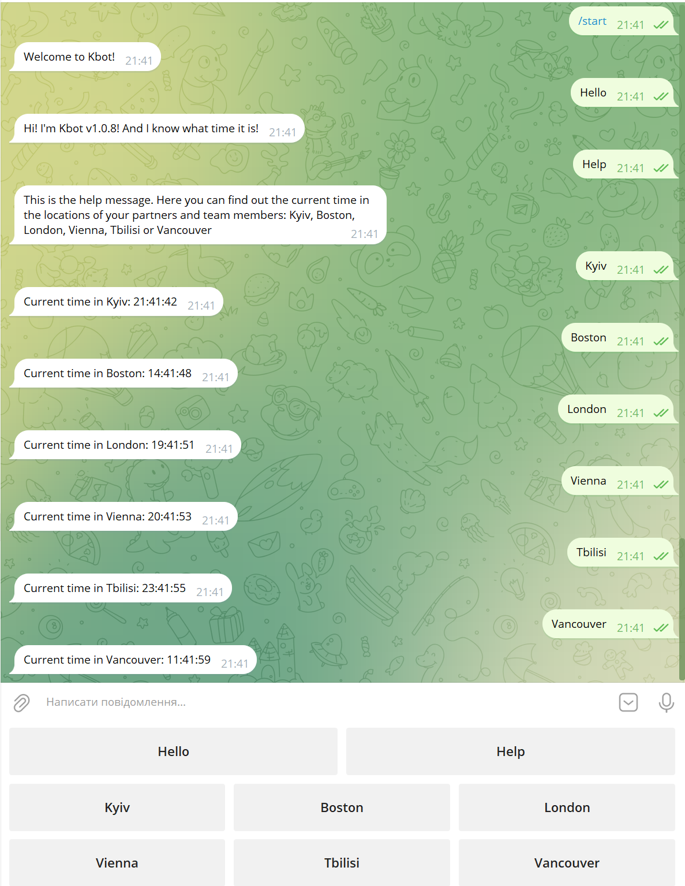

# Task 5: Coding Session - програмування телеграм бота на мові Golang
Telegram-бот матиме можливість обробляти повідомлення від користувачів та відповідати на них:
- Мова Golang  
- Фреймворки `github.com/spf13/cobra` та `gopkg.in/telebot.v3`  
- Реалізувати обробники повідомлень для бота, які будуть відповідати на повідомлення в Telegram.  
- Створити функції-обробники повідомлень бота.
- Додати ці функції до методів об'єкта `telebot.Bot`.
- Обробляти повідомлення відповідно до їх типу та вмісту.
## Інструкція користувача ботом визначення часу в містах світу, в яких працюють колеги
1. Перейдіть в Телеграм за постиланням [t.me/umanetsvitalii_bot](t.me/umanetsvitalii_bot)
2. Запустіть бот командою `/start`
3. Натисніть в меню потрібне місто та дізнайтесь який там зараз час  

